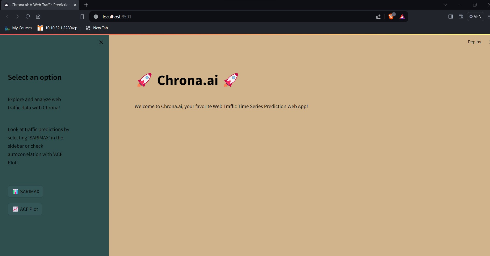

# Chrona.AI 

## Overview

Web traffic forecasting is crucial for website operators and administrators to efficiently manage resources, plan for scalability, and enhance user experience. This repository provides a forecasting model based on SARIMA and ACF Plot, a popular time series forecasting methods to display the timelines of various models using graphs and also help in predicting  future web traffic patterns.

## Features
An app with a unique UI is made for development of Web Traffic Time Series Forecasting

##video recording
video recording is put with the name CodeClause Internship Web Traffic in this branch. CLICK on view raw and it would download and the viewer could view the file
-

